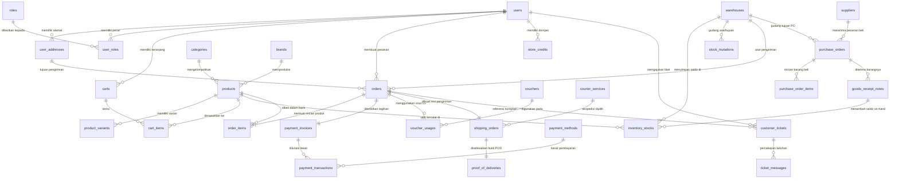

# 🏪 PT Nusantara SuperMart Indonesia — Monolith Seed Project

> **Repositori Proyek Seed untuk Mata Kuliah / Pelatihan Arsitektur Microservices**  
> Proyek *monolith* ritel dan rantai pasok (*supply chain*) *omnichannel* berskala enterprise siap pakai (full-stack: MySQL 8.0, Go Fiber v3, Angular 22). Dirancang khusus sebagai bahan ajar bagi mahasiswa untuk menganalisis batas-batas domain (*bounded contexts*) dan melakukan dekomposisi sistem menjadi arsitektur microservices.

---

## 📋 Daftar Isi

1. [Latar Belakang & Tujuan Pembelajaran](#-latar-belakang--tujuan-pembelajaran)
2. [Arsitektur Sistem Eksisting (Monolitik)](#-arsitektur-sistem-eksisting-monolitik)
3. [Arsitektur Relasional Basis Data (120 Tabel & 9 Kluster)](#-arsitektur-relasional-basis-data-120-tabel--9-kluster)
4. [Diagram Alur & Relasi Antar-Entitas (ERD Flow)](#-diagram-alur--relasi-antar-entitas-erd-flow)
5. [Fungsionalitas Lengkap Aplikasi per Peran Pengguna](#-fungsionalitas-lengkap-aplikasi-per-peran-pengguna)
6. [Titik Kopling Monolitik (Target Dekomposisi Mahasiswa)](#-titik-kopling-monolitik-target-dekomposisi-mahasiswa)
7. [Daftar Akun Demo & Kredensial Pengujian](#-daftar-akun-demo--kredensial-pengujian)
8. [Panduan Menjalankan Aplikasi (How to Run)](#-panduan-menjalankan-aplikasi-how-to-run)
   - [Opsi 1: Menjalankan Menggunakan Docker Compose (Rekomendasi)](#opsi-1-menjalankan-menggunakan-docker-compose-rekomendasi)
   - [Opsi 2: Menjalankan Secara Manual (Bare-Metal Local Development)](#opsi-2-menjalankan-secara-manual-bare-metal-local-development)
9. [Katalog Endpoint REST API Utama](#-katalog-endpoint-rest-api-utama)
10. [Panduan Praktikum & Roadmap Tugas Mahasiswa](#-panduan-praktikum--roadmap-tugas-mahasiswa)
11. [Troubleshooting & Solusi Masalah Umum](#-troubleshooting--solusi-masalah-umum)

---

## 🎓 Latar Belakang & Tujuan Pembelajaran

Di industri perangkat lunak modern, arsitektur *microservices* jarang dibangun langsung dari nol (*greenfield*). Kebanyakan organisasi memulai dengan sistem **monolitik**, kemudian secara bertahap memecahnya (*decomposition*) seiring pertumbuhan organisasi, skala transaksi, dan kompleksitas domain bisnis.

Proyek ini menghadirkan sistem monolitik ritel enterprise yang utuh dan berjalan nyata:
- **Basis Data Tunggal (`nusantara_db`)**: 120 tabel relasional yang saling terhubung melayani 9 kluster bisnis.
- **Backend Monolitik (Go 1.26 + Fiber v3)**: Satu *binary* terpadu dengan 9 paket domain internal yang memiliki titik kopling (*in-process coupling*) sinkron yang sengaja disematkan untuk dipecah.
- **Frontend SPA Terpadu (Angular 22)**: Antarmuka modern dengan *Signals*, *Standalone Components*, *Role-Based Routing*, dan portal interaktif untuk Pelanggan, Staf Gudang, Kurir, Agen CS, dan Super Admin.
- **Infrastruktur Docker Compose**: Otomasi lingkungan pengembangan lokal berbasis kontainer.

Mahasiswa ditugaskan untuk bertindak sebagai Software Architect / DevOps Engineer yang memodernisasi monolit ini menjadi arsitektur microservices berbasis *event-driven* atau *service mesh*.

---

## 🏛️ Arsitektur Sistem Eksisting (Monolitik)

```
                                  ┌─────────────────────────────────────────┐
                                  │             Angular 22 SPA              │
                                  │   (Pelanggan, Gudang, Kurir, CS, Admin) │
                                  └────────────────────┬────────────────────┘
                                                       │ HTTP REST (Port 4200 / 80)
                                                       ▼
                                  ┌─────────────────────────────────────────┐
                                  │          Nginx Reverse Proxy            │
                                  │        (/ -> SPA, /api -> Backend)      │
                                  └────────────────────┬────────────────────┘
                                                       │ Proxy Pass
                                                       ▼
                                  ┌─────────────────────────────────────────┐
                                  │          Go Fiber v3 Monolith           │
                                  │           (HTTP Port 3000)              │
┌─────────────────────────────────┴─────────────────────────────────────────┴─────────────────────────────────┐
│                                       9 PAKET DOMAIN INTERNAL                                              │
│ 1. auth         │ 2. catalog      │ 3. inventory    │ 4. order        │ 5. payment       │ 6. promotion    │
│    Akun & RBAC  │    Produk & SKU │    Stok & Hub   │    Cart & Order │    Invoice & Pay │    Voucher & Poin│
│─────────────────┼─────────────────┼─────────────────┼─────────────────┼──────────────────┼─────────────────│
│ 7. logistics    │ 8. procurement  │ 9. support      │                 │                  │                 │
│    Kurir & POD  │    PO & GRN     │    Tiket & Chat │                 │                  │                 │
└─────────────────────────────────┬─────────────────────────────────────────┬─────────────────────────────────┘
                                  │                                         │
                                  │ SQLX Connection Pool (Port 3306)        │
                                  ▼                                         ▼
                                  ┌─────────────────────────────────────────┐
                                  │               MySQL 8.0                 │
                                  │      (Basis Data 120 Tabel Fisik)       │
                                  └─────────────────────────────────────────┘
```

---

## 🗄️ Arsitektur Relasional Basis Data (120 Tabel & 9 Kluster)

Basis data `nusantara_db` dirancang dengan integritas relasional tinggi (*ACID Compliance* melalui *InnoDB Engine*). Ke-120 tabel dibagi ke dalam 9 kluster fungsional:

| # | Kluster Bisnis | Jumlah Tabel | Entitas Kunci / Tabel Utama | Ketergantungan Relasional Antar-Kluster |
|---|---|:---:|---|---|
| **1** | **Identitas, Akun, & RBAC** | 12 | `users`, `user_profiles`, `user_addresses`, `user_kyc_documents`, `roles`, `permissions`, `user_roles`, `role_permissions`, `auth_tokens`, `login_histories` | Menjadi referensi `user_id` bagi seluruh transaksi (Order, Tiket, Audit Gudang, Kurir, Profil). |
| **2** | **Katalog Produk & Merek** | 16 | `products`, `categories`, `brands`, `product_variants`, `product_images`, `product_attributes`, `product_reviews`, `tags` | Menjadi master data produk yang direferensikan oleh Order Items, Inventory Stocks, PO Items, Flash Sale. |
| **3** | **Inventaris & Multi-Gudang** | 15 | `warehouses`, `warehouse_zones`, `warehouse_shelves`, `inventory_stocks`, `stock_mutations`, `stock_reservations`, `stock_opnames`, `low_stock_alerts` | Mengikat `products` ke fasilitas `warehouses`. Berelasi logis ke `orders` untuk pemesanan/reservasi stok. |
| **4** | **Pemesanan & Transaksi Penjualan** | 18 | `orders`, `order_items`, `order_statuses`, `carts`, `cart_items`, `order_shipping_details`, `order_status_histories`, `order_discounts` | Pusat transaksi: menghubungkan `users`, `user_addresses`, `warehouses`, dan `products`. |
| **5** | **Pembayaran & Finansial** | 12 | `payment_invoices`, `payment_methods`, `payment_transactions`, `store_credits`, `credit_transactions`, `refunds`, `escrow_accounts` | Berelasi langsung dengan `orders` (1:1 untuk tagihan faktur) dan `users` (dompet kredit/refund). |
| **6** | **Promosi, Voucher, & Loyalitas** | 14 | `promotions`, `vouchers`, `voucher_usages`, `loyalty_points`, `point_transactions`, `point_redemptions`, `flash_sales` | Menghubungkan `vouchers` ke `orders` dan `users` saat pemotongan diskon transaksi. |
| **7** | **Logistik, Armada, & Kurir** | 13 | `courier_partners`, `courier_services`, `shipping_rates`, `vehicle_fleets`, `courier_drivers`, `shipping_orders`, `proof_of_deliveries` | Mengikat `orders` ke proses serah terima fisik kurir dan pencatatan nomor resi pelacakan. |
| **8** | **Pengadaan (Procurement) & Vendor** | 10 | `suppliers`, `supplier_contacts`, `purchase_orders`, `purchase_order_items`, `goods_receipt_notes`, `goods_receipt_items`, `purchase_invoices` | Menghubungkan `suppliers` ke `warehouses` dan `products` untuk pengisian ulang stok barang masuk. |
| **9** | **Layanan Pelanggan & Bantuan** | 10 | `customer_tickets`, `ticket_categories`, `ticket_messages`, `ticket_assignments`, `disputes`, `faq_articles` | Menghubungkan pelanggan (`users`), pesanan (`orders`), dan staf penanganan kendala (`agents`). |

---

## 📊 Diagram Alur & Relasi Antar-Entitas (ERD Flow)

Berikut visualisasi relasi induk lintas kluster tabel dalam sistem monolitik:



---

## 📱 Fungsionalitas Lengkap Aplikasi per Peran Pengguna

Aplikasi frontend Angular 22 menyediakan antarmuka terpisah berbasis peran yang disesuaikan untuk setiap aktor bisnis:

### 1. 🛍️ Portal Pelanggan (Customer)
- **Katalog & Navigasi**: Penelusuran produk retail dengan pencarian instan, filter kategori (Sembako, Minuman, Sayur Segar), filter merek, dan pengurutan harga/populer.
- **Keranjang Belanja (Cart)**: Pengaturan kuantitas barang, penambahan catatan khusus per item, estimasi subtotal, dan validasi kode voucher diskon.
- **Checkout Multi-Alamat & Hub Gudang**: Pemilihan alamat pengiriman terdaftar, pemilihan gudang pemenuhan terdekat (Jakarta Hub, Surabaya Hub, Denpasar Hub), dan pemilihan jenis kurir (Reguler, Next Day, Instan).
- **Pesanan Saya (Order History)**: Daftar pesanan dengan *status badges* (Menunggu Pembayaran, Diproses, Dikirim, Selesai), drawer detail transaksi, nomor resi pengiriman, serta simulator pembayaran instan.
- **Dompet Toko (Store Credit) & Poin Loyalitas**: Tampilan saldo dompet digital, riwayat transaksi kredit/debit, fitur top-up saldo, saldo poin reward, dan katalog penukaran poin.
- **Pusat Bantuan & FAQ**: Pangkalan pengetahuan artikel mandiri, pengajuan tiket keluhan baru terhubung ke nomor pesanan, dan rekam jejak obrolan dua arah dengan agen customer service.

### 2. 🏭 Portal Staf Gudang (Warehouse Staff)
- **Manajemen Stok Regional**: Pemantauan inventaris fisik real-time pada setiap cabang gudang (Jakarta, Surabaya, Denpasar). Menampilkan kuantitas *On-Hand*, kuantitas *Reserved*, dan *Available*.
- **Penyesuaian Stok (Stock Adjustment / Opname)**: Modal pembaruan saldo fisik aktual dan pencatatan alasan audit untuk mencegah selisih buku dan fisik.
- **Peringatan Stok Menipis (Low Stock Alerts)**: Peringatan otomatis produk yang berada di bawah ambang batas minimum (*reorder threshold*).
- **Mutasi Stok Antar-Gudang**: Formulir dan pencatatan riwayat transfer persediaan dari gudang asal ke gudang tujuan guna menyeimbangkan ketersediaan regional.
- **Penerimaan Barang Masuk (Goods Receipt Note / GRN)**: Verifikasi penerimaan kiriman dari pemasok berdasarkan Purchase Order (PO) yang disetujui. Pencatatan GRN **secara otomatis meningkatkan stok gudang tujuan**.

### 3. 🚚 Portal Kurir & Armada (Courier)
- **Daftar Penugasan Pengiriman**: Antrean paket pengiriman pesanan (*shipping orders*) dengan nomor resi pelacakan, berat timbangan, dan informasi nama/alamat penerima.
- **Pembaruan Status Pengiriman**: Aksi satu klik untuk mengubah status paket menjadi `PICKED_UP` (sudah dijemput dari gudang) dan `IN_TRANSIT` (sedang dalam perjalanan).
- **Penyelesaian Bukti Pengiriman (Proof of Delivery / POD)**: Modal konfirmasi serah terima paket yang mencatat nama penerima fisik, foto dokumentasi serah terima, dan catatan kurir. **Penyelesaian POD secara otomatis menyelesaikan status pesanan pembeli menjadi `DELIVERED`**.

### 4. 🎧 Portal Agen Bantuan (Customer Service Agent)
- **Antrean Tiket Terpadu**: Monitoring tiket keluhan pelanggan berdasarkan skala prioritas (`URGENT`, `HIGH`, `MEDIUM`, `LOW`) dan status (`OPEN`, `IN_PROGRESS`, `RESOLVED`, `CLOSED`).
- **Disposisi Penugasan (Assign to Me)**: Agen dapat mengambil alih tiket yang belum memiliki penanggung jawab.
- **Thread Percakapan Interaktif**: Panel obrolan bergaya chat untuk memberikan tanggapan resmi kepada pembeli secara real-time.
- **Resolusi Masalah**: Pengubahan status tiket menjadi selesai (*resolved*) setelah solusi disepakati.

### 5. ⚙️ Konsol Super Administrator (Super Admin)
- **Dashboard Eksekutif**: Ringkasan indikator kinerja utama (Total Transaksi Penjualan, Pendapatan Kotor, Item Kritis, Tiket Terbuka) dan panduan praktikum dekomposisi sistem monolitik.
- **Manajemen Pengguna & Otorisasi**: Daftar akun terdaftar, status keaktifan, dan pembagian peran hak akses (RBAC).
- **Verifikasi Identitas Legal (KYC Approval)**: Antrean verifikasi dokumen identitas resmi (KTP/NIK) pelanggan dengan tombol Persetujuan (*Approve*) atau Penolakan (*Reject*).
- **Master Katalog Produk**: Pengelolaan SKU produk baru, penetapan harga dasar, penugasan kategori dan merek, bobot satuan, serta status publikasi tayang.
- **Promosi & Voucher**: Pembuatan kode voucher belanja baru (potongan nominal, batas kuota pemakaian, tanggal kedaluwarsa) serta kampanye pemasaran musiman.

---

## 🔗 Titik Kopling Monolitik (Target Dekomposisi Mahasiswa)

Untuk memberikan studi kasus nyata dekomposisi microservices, backend monolitik ini sengaja mengimplementasikan **ketergantungan langsung dalam memori (*in-process coupling*)** antar-paket domain:

```
[ Checkout / Order Service ]
       │
       ├──(Kopling 1: Langsung panggil katalog)──► catalog.Service.GetProductByID()
       │
       └──(Kopling 2: Langsung panggil gudang)───► inventory.Service.ReserveStock()

[ Payment Service ]
       │
       └──(Kopling 3: Pelunasan langsung ubah order)──► order.Service.UpdateStatus("PAID")

[ Logistics Service ]
       │
       └──(Kopling 4: POD kurir langsung selesaikan order)──► order.Service.UpdateStatus("DELIVERED")

[ Procurement Service ]
       │
       └──(Kopling 5: Penerimaan GRN langsung mutasi stok)──► UPDATE inventory_stocks SET quantity_on_hand += ...
```

### 🎯 Rincian Kopling yang Harus Dipecah Mahasiswa:
1. **Order Service $\rightarrow$ Catalog & Inventory**:
   - *Kondisi Eksisting*: Saat fungsi `order.Service.CreateOrder` dipanggil, ia secara sinkron mengecek ketersediaan produk ke `catalog.Service` dan mengunci kuantitas stok di `inventory.Service`.
   - *Tugas Refaktor*: Pisahkan menjadi komunikasi asinkron berbasis *Message Broker* (Kafka/RabbitMQ) atau implementasikan pola **Saga Pattern** (*Orchestration/Choreography*) dengan kompensasi pembatalan reservasi jika pesanan kedaluwarsa.
2. **Payment Service $\rightarrow$ Order Service**:
   - *Kondisi Eksisting*: Saat faktur dilunasi (`payment.Service.PayInvoice`), service pembayaran memanggil langsung `order.Service.UpdateStatus(orderID, "PAID")`.
   - *Tugas Refaktor*: Publikasikan domain event `PaymentCompletedEvent` ke message bus, di mana Order Service bertindak sebagai subscriber independen.
3. **Logistics Service $\rightarrow$ Order Service**:
   - *Kondisi Eksisting*: Saat kurir menuntaskan POD (`logistics.Service.SubmitPOD`), status pesanan langsung diubah menjadi `DELIVERED` lewat pemanggilan fungsi lokal.
   - *Tugas Refaktor*: Ganti dengan *Domain Event* `ShipmentDeliveredEvent` atau pemanggilan RPC (*gRPC* antar-layanan) dengan mekanisme *retry* dan *circuit breaker*.
4. **Procurement Service $\rightarrow$ Inventory Database**:
   - *Kondisi Eksisting*: Transaksi pencatatan GRN di `procurement.Service` secara langsung mengeksekusi query SQL pembaruan stok ke tabel `inventory_stocks`.
   - *Tugas Refaktor*: Pisahkan basis data pengadaan (`procurement_db`) dan inventaris (`inventory_db`), lalu gunakan API/Event `StockReplenishedEvent` untuk memperbarui stok.

---

## 👥 Daftar Akun Demo & Kredensial Pengujian

Semua akun pra-konfigurasi dalam `seed.sql` menggunakan kata sandi yang sama: **`password123`**

| Peran (Role) | Alamat Email | Kata Sandi | Portal Akses & Alur Uji Coba |
|---|---|---|---|
| **Super Admin** | `admin@nusantara-supermart.co.id` | `password123` | Dashboard Admin, Verifikasi KYC, Kelola Pengguna, Katalog, Voucher Promosi. |
| **Staf Gudang Jakarta** | `budi.gudang@nusantara-supermart.co.id` | `password123` | Pantau Stok Jakarta Hub, Lakukan Penyesuaian Stok, Mutasi Barang, Terima GRN. |
| **Staf Gudang Surabaya** | `eko.gudang@nusantara-supermart.co.id` | `password123` | Pantau Stok Surabaya Hub, Mutasi Barang ke Jakarta/Bali, Terima Pasokan GRN. |
| **Kurir Jakarta** | `kurir.jkt@nusantara-supermart.co.id` | `password123` | Antrean Kiriman Jakarta, Ubah ke In-Transit, Konfirmasi POD dengan Foto. |
| **Kurir Surabaya** | `kurir.sby@nusantara-supermart.co.id` | `password123` | Antrean Kiriman Surabaya, Ubah ke In-Transit, Konfirmasi POD dengan Foto. |
| **Agen CS** | `siti.cs@nusantara-supermart.co.id` | `password123` | Antrean Tiket Bantuan, Ambil Tiket (*Assign*), Kirim Balasan Pesan ke Pelanggan. |
| **Pelanggan (Siti)** | `siti.aminah@gmail.com` | `password123` | Belanja Katalog, Masukkan Keranjang, Checkout Alamat, Bayar Tagihan, Dompet. |
| **Pelanggan (Budi)** | `budi.santoso@yahoo.com` | `password123` | Belanja Katalog, Masukkan Voucher Promo, Buat Pesanan, Ajukan Tiket Bantuan CS. |

> 💡 **Fitur Praktis**: Halaman login (`/auth/login`) dilengkapi tombol **1-Click Test Login** untuk setiap akun di atas sehingga Anda tidak perlu mengetikkan email dan password berulang kali.

---

## 🚀 Panduan Menjalankan Aplikasi (How to Run)

Anda dapat menjalankan aplikasi ini menggunakan dua cara: **Docker Compose** (paling mudah dan disarankan) atau **Manual Bare-Metal**.

### Opsi 1: Menjalankan Menggunakan Docker Compose (Rekomendasi)

Pastikan Docker Desktop / Docker Engine telah terpasang dan berjalan di komputer Anda.

#### 1. Salin File Konfigurasi Lingkungan
Buka terminal pada direktori utama proyek:
```bash
cp .env.example .env
```

#### 2. Jalankan Seluruh Kontainer
```bash
docker compose up --build
```
Perintah ini akan secara otomatis:
1. Menyalakan kontainer basis data `mysql:8.0` pada port `3306`.
2. Menjalankan migrasi skema `db.sql` (120 tabel) dan data awal `seed.sql`.
3. Mengompilasi dan menjalankan kontainer backend Go Fiber pada port `3000`.
4. Mengompilasi kode Angular 22 dan menyajikan aplikasi melalui web server Nginx pada port `4200` (dengan reverse proxy `/api` otomatis ke backend).

#### 3. Akses Aplikasi di Browser
- **Frontend SPA**: [http://localhost:4200](http://localhost:4200)
- **Backend Healthcheck API**: [http://localhost:3000/api/v1/health](http://localhost:3000/api/v1/health)
- **MySQL Database**: `localhost:3306` (User: `nusantara_user`, Password: `nusantara_secret`, Database: `nusantara_db`)

Untuk menghentikan kontainer:
```bash
docker compose down
# atau jika ingin menghapus volume database untuk reset bersih:
docker compose down -v
```

---

### Opsi 2: Menjalankan Secara Manual (Bare-Metal Local Development)

Gunakan metode ini jika Anda ingin melakukan *debugging* aktif pada kode Go atau Angular.

#### Prasyarat Lingkungan:
- **Go**: Versi 1.24 atau lebih baru (direkomendasikan Go 1.26).
- **Node.js**: Versi 20.x atau 22.x LTS dengan npm.
- **MySQL Server**: Versi 8.0 (lokal atau via kontainer tunggal).

---

#### Langkah A: Persiapan Basis Data MySQL

Jika Anda memiliki MySQL lokal yang sedang berjalan:
```bash
# 1. Masuk ke MySQL client sebagai root
mysql -u root -p

# 2. Buat database dan berikan hak akses pengguna
CREATE DATABASE nusantara_db CHARACTER SET utf8mb4 COLLATE utf8mb4_unicode_ci;
CREATE USER 'nusantara_user'@'%' IDENTIFIED BY 'nusantara_secret';
GRANT ALL PRIVILEGES ON nusantara_db.* TO 'nusantara_user'@'%';
FLUSH PRIVILEGES;
EXIT;

# 3. Impor skema 120 tabel dan data seed
mysql -u nusantara_user -pnusantara_secret nusantara_db < db.sql
mysql -u nusantara_user -pnusantara_secret nusantara_db < seed.sql
```

*Alternatif Praktis Menggunakan Docker MySQL:*
```bash
docker run -d --name mysql-supermart -p 3306:3306 \
  -e MYSQL_ROOT_PASSWORD=root_secret \
  -e MYSQL_DATABASE=nusantara_db \
  -e MYSQL_USER=nusantara_user \
  -e MYSQL_PASSWORD=nusantara_secret \
  mysql:8.0 --default-authentication-plugin=mysql_native_password

# Tunggu hingga MySQL siap, lalu jalankan script inisialisasi:
./scripts/init-db.sh
```

---

#### Langkah B: Menjalankan Backend (Go Monolith)

1. Masuk ke folder backend:
   ```bash
   cd backend
   ```
2. Salin konfigurasi environment lokal:
   ```bash
   cp ../.env.example .env
   ```
   *Pastikan nilai `MYSQL_HOST=localhost` di file `.env` jika backend dijalankan di luar docker.*
3. Unduh dependensi dan kompilasi:
   ```bash
   go mod tidy
   go build -v .
   ```
4. Jalankan server backend:
   ```bash
   go run main.go
   ```
   Backend akan menyala dan mendengarkan permintaan di `http://localhost:3000`.

---

#### Langkah C: Menjalankan Frontend (Angular 22 SPA)

1. Buka jendela terminal baru dan masuk ke folder frontend:
   ```bash
   cd frontend
   ```
2. Pasang dependensi Node:
   ```bash
   npm install
   ```
3. Jalankan server pengembangan Angular:
   ```bash
   npm start
   ```
   Aplikasi frontend akan terbuka dan dapat diakses melalui browser pada tautan: [http://localhost:4200](http://localhost:4200).

---

## 📡 Katalog Endpoint REST API Utama

Backend menyajikan endpoint RESTful terstandarisasi di bawah rute `/api/v1`:

### 1. Autentikasi & Akun (`/api/v1/auth`)
- `POST /auth/login` — Autentikasi pengguna & penerbitan token JWT.
- `POST /auth/register` — Pendaftaran akun pelanggan baru.
- `GET  /auth/me` — Profil pengguna yang sedang masuk (*Bearer Token*).
- `PUT  /auth/me` — Pembaruan biodata profil pengguna.
- `GET  /auth/addresses` — Buku alamat pengiriman pengguna.
- `POST /auth/addresses` — Penambahan alamat tujuan pengiriman baru.
- `GET  /auth/users` — *(Super Admin)* Daftar seluruh pengguna sistem.
- `GET  /auth/kyc` — *(Super Admin)* Antrean berkas verifikasi identitas legal KYC.
- `PUT  /auth/kyc/:id/verify` — *(Super Admin)* Persetujuan/penolakan status KYC.

### 2. Katalog Produk (`/api/v1/catalog`)
- `GET    /catalog/products` — Daftar katalog produk (mendukung query parameter `search`, `category_id`, `min_price`, `limit`).
- `GET    /catalog/products/:id` — Informasi detail produk berdasarkan ID.
- `GET    /catalog/categories` — Master kategori barang.
- `GET    /catalog/brands` — Master merek dagang.
- `POST   /catalog/products` — *(Super Admin)* Pembuatan SKU barang baru.
- `DELETE /catalog/products/:id` — *(Super Admin)* Penghapusan produk dari katalog.

### 3. Inventaris & Gudang (`/api/v1/inventory`)
- `GET /inventory/warehouses` — Daftar fasilitas gudang regional.
- `GET /inventory/stocks` — *(Staff/Admin)* Saldo stok per produk dan gudang.
- `PUT /inventory/stocks/:id/adjust` — *(Staff/Admin)* Penyesuaian fisik stok aktual.
- `GET /inventory/alerts` — *(Staff/Admin)* Daftar peringatan stok menipis (*low stock*).
- `GET /inventory/mutations` — *(Staff/Admin)* Riwayat pemindahan stok antar-gudang.
- `POST /inventory/mutations` — *(Staff/Admin)* Eksekusi transfer mutasi stok baru.

### 4. Transaksi & Keranjang (`/api/v1/order`)
- `GET    /order/cart` — Mengambil isi keranjang belanja pelanggan aktif.
- `POST   /order/cart/items` — Menambahkan barang ke dalam keranjang.
- `DELETE /order/cart/items/:id` — Menghapus item dari keranjang.
- `POST   /order/checkout` — Checkout keranjang menjadi pesanan (*Order*) resmi.
- `GET    /order/orders` — Daftar riwayat pesanan pelanggan.
- `GET    /order/orders/:id` — Rincian faktur dan barang dalam pesanan.
- `PUT    /order/orders/:id/cancel` — Pembatalan pesanan yang belum terbayar.

### 5. Pembayaran & Dompet (`/api/v1/payment`)
- `GET  /payment/invoices/:id` — Rincian tagihan faktur pesanan.
- `POST /payment/invoices/:id/pay` — Simulasi pelunasan tagihan (Metode: Dompet Toko, Virtual Account BCA/Mandiri, QRIS Dinamis).
- `GET  /payment/wallet` — Informasi saldo dompet toko (*store credit*) dan transaksi mutasi.
- `POST /payment/wallet/topup` — Penambahan saldo dompet pelanggan.

### 6. Promosi & Loyalitas (`/api/v1/promotions`)
- `GET  /promotions/vouchers` — Daftar kode voucher belanja yang tersedia.
- `POST /promotions/vouchers/validate` — Validasi kelayakan kode voucher saat checkout.
- `POST /promotions/vouchers` — *(Super Admin)* Penerbitan kode voucher baru.
- `GET  /promotions/loyalty` — Saldo poin loyalitas keanggotaan pengguna.
- `POST /promotions/loyalty/redeem` — Penukaran poin loyalitas menjadi reward.

### 7. Logistik & Kurir (`/api/v1/logistics`)
- `GET  /logistics/shipments` — *(Kurir/Admin)* Antrean paket pengiriman pesanan.
- `PUT  /logistics/shipments/:id/status` — *(Kurir/Admin)* Pembaruan status paket (`PICKED_UP`, `IN_TRANSIT`).
- `POST /logistics/shipments/:id/pod` — *(Kurir/Admin)* Unggah bukti serah terima (Proof of Delivery / POD).

### 8. Pengadaan & Pemasok (`/api/v1/procurement`)
- `GET  /procurement/purchase-orders` — *(Staff/Admin)* Daftar Purchase Order (PO).
- `POST /procurement/purchase-orders/:id/approve` — *(Staff/Admin)* Persetujuan PO.
- `GET  /procurement/grn` — *(Staff/Admin)* Daftar Berita Acara Penerimaan Barang (GRN).
- `POST /procurement/grn` — *(Staff/Admin)* Pencatatan GRN (otomatis menambah stok on-hand).

### 9. Layanan Pelanggan (`/api/v1/support`)
- `GET  /support/faq` — Artikel panduan bantuan publik.
- `GET  /support/tickets` — Daftar tiket bantuan (milik pelanggan atau antrean CS).
- `POST /support/tickets` — Pembukaan tiket bantuan baru oleh pelanggan.
- `GET  /support/tickets/:id` — Detail tiket dan thread riwayat pesan.
- `POST /support/tickets/:id/messages` — Pengiriman pesan balasan di dalam tiket.
- `PUT  /support/tickets/:id/assign` — *(CS Agent)* Klaim penugasan tiket bantuan.
- `PUT  /support/tickets/:id/status` — *(CS Agent)* Pembaruan status penanganan tiket.

---

## 🗺️ Panduan Praktikum & Roadmap Tugas Mahasiswa

Proyek ini dirancang untuk diselesaikan dalam 4 tahapan *milestone* praktikum mata kuliah:

### 🎯 Milestone 1: Domain-Driven Design (DDD) & Pemisahan Bounded Context
- Analisis ke-120 tabel basis data dan klasifikasikan ke dalam *Core Domains*, *Supporting Domains*, dan *Generic Domains*.
- Buat peta konteks (*Context Map*) yang mengidentifikasi relasi antar-domain (*Upstream-Downstream*, *Customer-Supplier*, *Shared Kernel*).
- Identifikasi titik kopling sinkron yang terdapat pada kode `backend/internal/`.

### 🎯 Milestone 2: Ekstraksi Layanan Microservice Pertama (Auth & Catalog Service)
- Pisahkan paket `internal/auth` dan `internal/catalog` menjadi dua repositori/proses mandiri.
- Pisahkan skema tabelnya dari `nusantara_db` menjadi basis data terisolasi: `auth_db` dan `catalog_db` (*Database-per-Service*).
- Terapkan otentikasi stateless menggunakan verifikasi JWT terdistribusi atau integrasikan **API Gateway** (seperti Kong, Traefik, atau Ocelot).

### 🎯 Milestone 3: Komunikasi Asinkron & Saga Pattern pada Alur Transaksi
- Pasang *Message Broker* (Apache Kafka atau RabbitMQ).
- Refaktor proses checkout: alih-alih memanggil `inventory.Service` secara sinkron, publikasikan event `OrderCreatedEvent`.
- Implementasikan pola **SAGA Choreography / Orchestration**:
  - `OrderCreated` $\rightarrow$ `ReserveInventory` $\rightarrow$ `InventoryReserved` $\rightarrow$ `ProcessPayment`.
  - Jika pembayaran gagal/kedaluwarsa, kirim event kompensasi `ReleaseInventoryReservation`.

### 🎯 Milestone 4: Kontainerisasi, Observabilitas, & Service Mesh
- Buat konfigurasi *Kubernetes Manifests* / *Helm Charts* untuk seluruh layanan yang telah didekomposisi.
- Konfigurasikan *Distributed Tracing* menggunakan OpenTelemetry dan Jaeger untuk melacak jejak latensi antar-microservice.
- Terapkan *Health Check Probes* (`livenessProbe`, `readinessProbe`) dan *Rate Limiting*.

---

## 🔧 Troubleshooting & Solusi Masalah Umum

### 1. Masalah: Port 3306 atau Port 3000 Bentrok (*Address already in use*)
- **Penyebab**: Terdapat instance MySQL lokal atau proses Go lain yang sedang berjalan dan menggunakan port tersebut.
- **Solusi**:
  - Matikan MySQL lokal: `sudo service mysql stop` (Linux) atau `brew services stop mysql` (macOS).
  - Atau ubah pemetaan port pada `docker-compose.yml`, misalnya: `"3307:3306"` untuk MySQL.

### 2. Masalah: Autentikasi MySQL Gagal (*Authentication plugin 'caching_sha2_password'*)
- **Solusi**: Pastikan instance MySQL menggunakan plugin native:
  ```sql
  ALTER USER 'nusantara_user'@'%' IDENTIFIED WITH mysql_native_password BY 'nusantara_secret';
  FLUSH PRIVILEGES;
  ```

### 3. Masalah: CORS Error di Browser saat Frontend Memanggil Backend
- **Penyebab**: Konfigurasi header CORS backend belum mencakup origin frontend Anda.
- **Solusi**: Pastikan environment variable `CORS_ORIGINS` di backend mencakup origin `http://localhost:4200` dan `http://127.0.0.1:4200`.

### 4. Masalah: Inisialisasi Database Docker Tidak Menjalankan `seed.sql`
- **Penyebab**: Volume `mysql_data` lama masih menyimpan status instalasi sebelumnya.
- **Solusi**: Hapus volume lama dengan perintah:
  ```bash
  docker compose down -v
  docker compose up --build
  ```

---

## 📄 Lisensi
Lisensi Penggunaan Bahan Ajar Terbatas — PT Nusantara SuperMart Indonesia Course Materials. Dibuat untuk keperluan simulasi pendidikan rekayasa perangkat lunak dan arsitektur microservices.
## Setup Database Domain Identity

### Spesifikasi Database
- **DBMS**: PostgreSQL 15 (Alpine)
- **Port Host**: 5431
- **Port Container**: 5432
- **Database Name**: identity_db
- **Username**: root
- **Password**: secretpassword

### Perintah Operasional Container
- **Menyalakan Container**: `docker compose up -d`
- **Mengecek Status/Healthcheck**: `docker compose ps`
- **Mematikan Container**: `docker compose down`